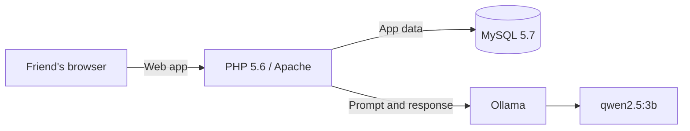

# FriendForge AI — Build for a Friend

*This is a submission for the [Hacktoberfest Weekend Challenge: Build for a Friend](https://dev.to/challenges/hacktoberfest-weekend-2026-10-01).*

## What I Built

I built FriendForge AI, a private personal AI companion for a friend who wants to improve their English, organize daily tasks, and practice conversations without sending personal notes or practice data to a third-party AI service.

FriendForge brings together goals, tasks, private notes, vocabulary practice, AI chat, and AI-generated study plans in one small web app. The AI can, for example, act as an English conversation or interview practice partner and help create a study plan based on the friend's goals.

## Demo

The app runs locally at [http://localhost:8080](http://localhost:8080) when started with Docker Compose. The local demo has been opened in a browser, and a test prompt received a response from the local model.

A short browser walkthrough, including a real response from the local model, is available as [friendforge-demo.webm](./friendforge-demo.webm). Upload this video in the DEV editor when publishing the post; the localhost URL is not publicly accessible.

To run it:

1. Install Docker Desktop and clone the repository.
2. Copy `.env.example` to `.env`.
3. Run `docker compose up -d --build`.
4. Download the default model with `docker compose exec ollama ollama pull qwen2.5:3b`.
5. Open [http://localhost:8080](http://localhost:8080).

This is a local development URL, not a publicly hosted demo. The video file is included in the repository for sharing with the submission.

## Code

The source code is available at [github.com/mah-shamim/friend-forge](https://github.com/mah-shamim/friend-forge). The project is licensed under the [MIT License](../LICENSE).

## How I Built It

FriendForge is a PHP 5.6 web application packaged with Docker Compose. MySQL stores the app's data, and a separate Ollama container runs the open-weight `qwen2.5:3b` model. The PHP app calls Ollama over the private Docker network; it does not need a hosted AI API.

The model, Ollama endpoint, and database connection are configurable through environment variables. See the [project setup guide](../README.md) for the complete stack and startup instructions.

## Why Does Open Innovation Matter?

The open-weight model and locally runnable Ollama server make the core AI feature possible without sending prompts to a hosted AI provider. The friend can keep the app, model, and data on a computer they control. After the model has been downloaded, inference can run locally without a hosted AI API; running the whole setup with the computer disconnected from the internet has not yet been independently tested.

Using an open model also keeps the model choice flexible: the configured model or Ollama-compatible endpoint can be changed without redesigning the PHP application. The project is MIT-licensed, so the code can be inspected and adapted.

## My Agent Session

No shareable agent session link is included yet.

## Prize Categories

No partner prize category has been confirmed. Add the applicable categories here if entering any, or remove this section.

---

### Before publishing

- Upload `docs/friendforge-demo.webm` to the DEV post as its video demo.
- Confirm the friend description and that the friend is comfortable being described this way.
- Add a shareable agent session link, if available.
- Confirm applicable prize categories and required tags on the challenge page.
